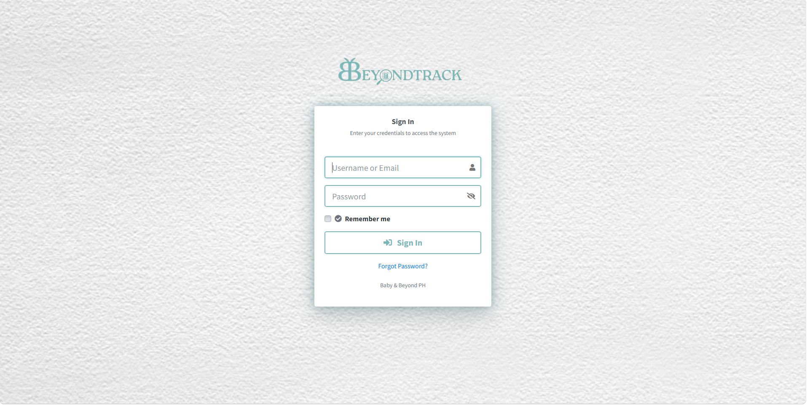
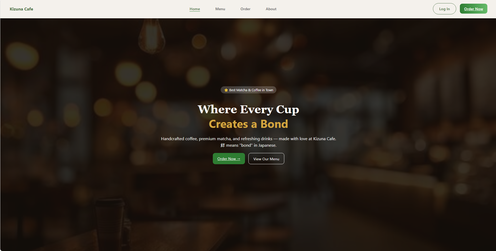
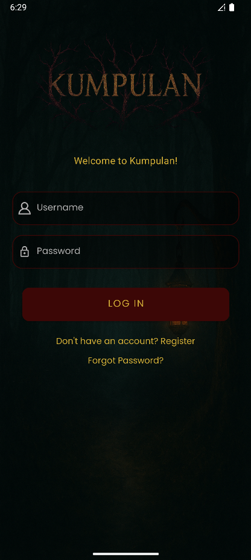
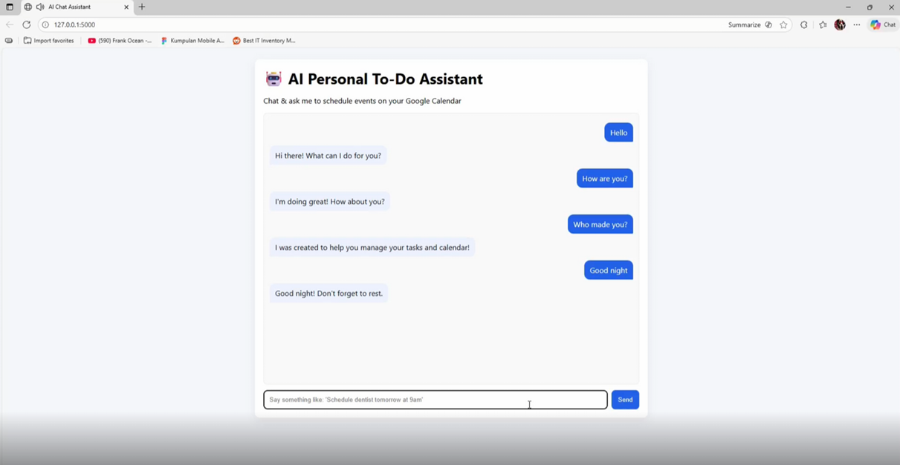

# ☕ Robyn John

### BS Computer Science Student

Building modern websites and web applications.

---

# 👨‍💻 About Me

### Hey there! 👋

I'm **Robyn John**, a BS Computer Science student from **STI College Cubao**.

I specialize in building modern web applications using Laravel and helping businesses improve their online presence through custom websites and redesigns.

### Currently Focused On

☕ Cafe Websites   •   🌐 Business Websites   •   📦 Inventory Systems

🚀 Laravel Development   •   📚 Continuous Learning

---

# ⚡ Tech Stack

---

# 📌 Featured Projects

<table>
<tr>

<td width="50%" valign="top">

## 📦 BeyondTrack

Inventory Management System with Barcode Support.

### Features

* Product Management
* Barcode Generation
* Inventory Tracking
* Sales Monitoring
* Reporting System

</td>

<td width="50%" valign="top">

## ☕ Cafe Website Concept

Modern responsive website concept for cafes and restaurants.

### Features

* Mobile Responsive
* Online Menu
* Contact Forms
* Location Integration
* Modern UI/UX

</td>

</tr>
<tr>

<td width="50%" valign="top">

## 📱 Kumpulan

Filipino Entity Catalog: an Android app for exploring mythological beings, gods, and heroes from Philippine folklore, with offline access.

### Features

* Offline Browsing via SQLite Cache
* Search & Filter by Name, Region, and Tags
* Bookmark / Save Favorite Entities
* Multiple-Choice Quizzes (Easy, Medium, Hard)
* User Accounts with Profile & Badge Mastery

**Built with:** Java / Kotlin • XML • SQLite • Android Studio • Figma

</td>

<td width="50%" valign="top">

## 🤖 AI-Powered Personal To-Do Assistant

A smart assistant that understands natural language commands and automatically manages tasks, reminders, and schedules.

### Features

* Natural Language Scheduling
* Google Calendar Integration
* Date & Time Interpretation
* Intent Detection (Schedule, Update, Delete, Reminder, Chitchat)
* Simple Web Chat Interface

**Built with:** Python • Flask • scikit-learn • GPT-4o-mini • Google Calendar API

</td>

</tr>
</table>

---

# 🌐 Website Development

Custom websites built using Laravel.

### Features

* Modern Design
* Mobile Responsive
* Fast Performance
* Business Focused
* Client Contact Forms

---

# 📈 GitHub Statistics

---

# 🏆 Current Goals

✅ Build more Laravel projects

✅ Grow freelance client base

✅ Create professional business websites

✅ Improve UI/UX design skills

✅ Learn advanced Laravel architecture

---

# 📫 Connect With Me

---

> "Job's finished? I dont think so."

⭐ Thanks for visiting my profile!

